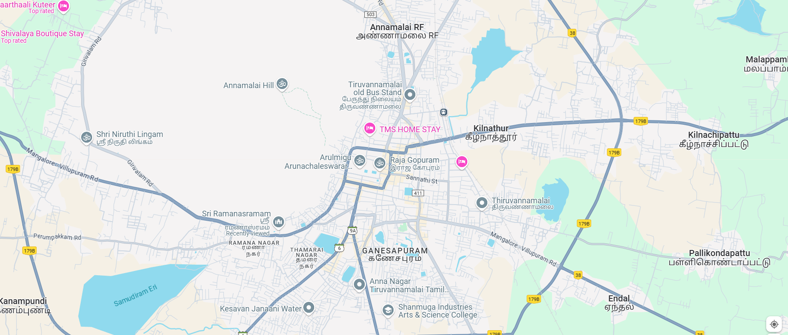

# Ex04 Places Around Me
## Date:25/11/2024 

## AIM
To develop a website to display details about the places around my house.

## DESIGN STEPS

### STEP 1
Create a Django admin interface.

### STEP 2
Download your city map from Google.

### STEP 3
Using ```<map>``` tag name the map.

### STEP 4
Create clickable regions in the image using ```<area>``` tag.

### STEP 5
Write HTML programs for all the regions identified.

### STEP 6
Execute the programs and publish them.

## CODE
```
map.html
<html>
<head>
<title>My Native</title>
</head>
<body>
<h1 align="center">
<font color="blue"><b>thiruvannamalai</b></font>    
</h1>
<h3 align="center">
<font color="green"><b>Gajalakshmi.M (24900240)</b></font>    
</h3>
<center>


<map name="My Native">
    <area target="" alt="temple" title="temple" href="temple.html" coords="816,340,644,390" shape="rect">
    <area target="" alt="college" title="college" href="college.html" coords="894,742,1115,685" shape="rect">
    <area target="" alt="ramanasranam" title="ramanasranam" href="ramanasranam.html" coords="546,543,102" shape="circle">
    <area target="" alt="bus stand" title="bus stand" href="bus stand.html" coords="765,165,964,264" shape="rect">
    <area target="" alt="village" title="village" href="village.html" coords="1528,560,1780,619" shape="rect">
</map>    
</center>
</body>
</html>

bus stand.html
<html>
<head>
<title>My native</title>
</head>
<body bgcolor="violet">
<h1 align="center">
<font color="violet"><b>thiruvannamalai</b></font>    
</h1>
<h3 align="center">
<font color="orange"><b>old bus stand</b></font>    
</h3>
<hr size="3" color="indigo">
<p align="justify">
<front face="Georgia" size="S">
    The Tiruvannamalai bus stand serves as a vital hub, ensuring good connectivity to major towns and cities. However, the facility struggles with several challenges that diminish the experience for travelers. Food stalls, though numerous, fail to maintain acceptable quality standards, leaving passengers with limited hygienic options. The condition of the toilets is particularly concerning, with poor maintenance making them almost unusable for many. The bus stand is perpetually overcrowded, adding to the discomfort of commuters. Littering is rampant, with insufficient measures to address waste management, resulting in an unclean environment. 
<p>
</body>
</html>

college.html
<html>
<head>
<title>My native</title>
</head>
<body bgcolor="blue">
<h1 align="center">
<font color="violet"><b>thiruvannamalai</b></font>    
</h1>
<h3 align="center">
<font color="orange"><b>Shanmuga arts and science college</b></font>    
</h3>
<hr size="3" color="indigo">
<p align="justify">
<front face="Georgia" size="S">
  shanmuga Industries Arts and science college was established in 1999 by shanmuga industries Educational trust,tiruvannamalai.It is popularly known as SIASC,Co educational institution promoted by shanmuga industries Educational system 
<p>
</body>
</html>

ramanasranam.html
<html>
<head>
<title>My native</title>
</head>
<body bgcolor="yellow">
<h1 align="center">
<font color="violet"><b>thiruvannamalai</b></font>    
</h1>
<h3 align="center">
<font color="orange"><b>ramanasranam</b></font>    
</h3>
<hr size="3" color="indigo">
<p align="justify">
<front face="Georgia" size="S">
  sri ramanasranam also known as sri ramanasranam ,is the ashram which was home to modern sage and advaita vedanta master RAMANA MAHARSHI from 1922 until his death 1950.It is situated at the foot of Arunachala hill
<p>
</body>
</html>

temple.html
<html>
<head>
<title>My native</title>
</head>
<body bgcolor="red">
<h1 align="center">
<font color="violet"><b>thiruvannamalai</b></font>    
</h1>
<h3 align="center">
<font color="orange"><b>Arulmigu arunachaleshwarar temple</b></font>    
</h3>
<hr size="3" color="indigo">
<p align="justify">
<front face="Georgia" size="S">
 Arunachaleshwarar Temple also called as annamalaiyar temple ,is a Hindu temple dedicated to the god Shiva and goddess parvathy.located at the base of arunachala hills in the town of thiruvannamalai in Tamilnadu,India.It is significant to the hindu sect of shaivism as one of the temples associated with 5 elements.the Pancha Bhuta sthalas,and specifically the elements of fire,or agni 
<p>
</body>
</html>

village.html
<html>
<head>
<title>My native</title>
</head>
<body bgcolor="white">
<h1 align="center">
<font color="violet"><b>thiruvannamalai</b></font>    
</h1>
<h3 align="center">
<font color="orange"><b>pallikondanpattu</b></font>    
</h3>
<hr size="3" color="indigo">
<p align="justify">
<front face="Georgia" size="S">
    Pallikondapattu is a small hamlet in the town of Tiruvannamalai. This village is around 5 km before Tiruvannamalai, off National Highway 66 (NH66) and forms part of the postal area of "Chinakangiyanur".

    This village is surrounded by a big lake on one corner and farms on all other sides. The village is totally dependent on North-West Monsoon. It is lush green during rainy days and extremely dry in summer. 
<p>
</body>
</html>
```
## OUTPUT


## RESULT
The program for implementing image maps using HTML is executed successfully.
